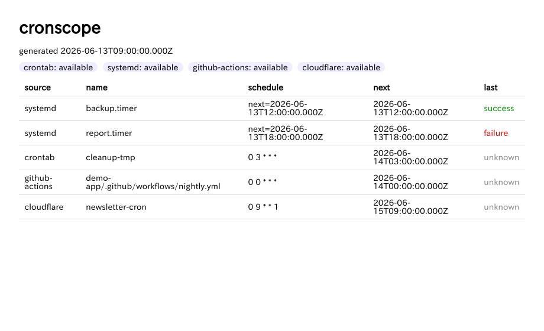

# cronscope

> **cronscope** discovers and monitors your scheduled jobs across surfaces —
> local **crontab** & **systemd** timers, **GitHub Actions**, and **Cloudflare**
> Workers cron — from a single CLI. Zero-config for local; opt-in token for
> Cloudflare. `npx cronscope` and see everything that's scheduled, what's
> overdue, and what failed. Get Slack alerts when a job breaks.

ローカル(crontab / systemd)と各種サービス(GitHub Actions, Cloudflare)の
定時実行を**横断的に発見・可視化**し、fail / overdue を Slack 通知する CLI。
AI 開発時代に「自分の環境で何が定時実行されていて、何が落ちているか」を
把握しきれなくなる問題を、pull 型の状態取得で解く。



## インストール / 使い方

```sh
npx cronscope scan          # 発見して一覧表示（ゼロ設定）
npx cronscope serve [port]  # localhost ダッシュボード
npx cronscope check         # fail/overdue を Slack 通知（systemd timer で定期実行推奨）
```

## コネクタ（段差 tier 型）

| tier | コネクタ | 取得 | 認証 |
|---|---|---|---|
| 0 | crontab | `crontab -l` をパース、次回実行を算出 | 不要 |
| 0 | systemd | user timer/service を `systemctl --user show` | 不要 |
| 0 | github-actions | `~/dev` 配下の `.github/workflows/*.yml` を走査 | 不要 |
| 1 | cloudflare | API で Workers cron triggers を列挙（BYOK） | API token |

状態を取れないソース（crontab 等）は正直に `unknown` 表示し、アラート対象外にする。

## 設定

`~/.config/cronscope/config.json`（任意）:
- `scanRoots`: GHA 走査対象（既定 `~/dev`）
- `overdue.graceMinutes`: overdue 猶予（既定 60）

トークン類は **env 優先**（config に生値を置かない）:
- `CRONSCOPE_CF_API_TOKEN` / `CRONSCOPE_CF_ACCOUNT_ID` — Cloudflare（任意）
- `CRONSCOPE_SLACK_WEBHOOK_URL` — Slack 通知

## secret / プライバシー方針

- discovery snapshot・Web 表示は正規化済み allowlist フィールドのみ。元データ(`raw`)は永続化しない。
- `target` / `location` は表示前に redaction（token・URL 内資格情報をマスク）。
- token は env から読み、config / repo / snapshot に生値を残さない。

## ライセンス

MIT © 2026 wharfe
