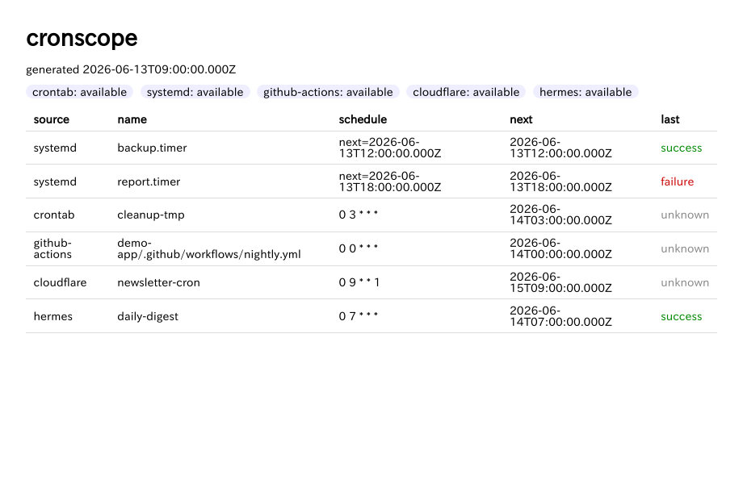

# cronscope

> **cronscope** discovers and monitors your scheduled jobs across surfaces —
> local **crontab**, **systemd** timers & **launchd** agents, **GitHub Actions**, **Cloudflare**
> Workers cron, and **Hermes Agent** cron — from a single CLI. Zero-config for
> local; opt-in token for Cloudflare. `npx cronscope` and see everything that's
> scheduled, what's overdue, and what failed. Get Slack alerts when a job breaks.

ローカル(crontab / systemd / launchd)と各種サービス(GitHub Actions, Cloudflare, Hermes Agent)の
定時実行を**横断的に発見・可視化**し、fail / overdue を Slack 通知する CLI。
AI 開発時代に「自分の環境で何が定時実行されていて、何が落ちているか」を
把握しきれなくなる問題を、pull 型の状態取得で解く。AI エージェント（Hermes Agent）の
cron も監視対象に含む。



## インストール / 使い方

```sh
npx cronscope scan          # 発見して一覧表示（ゼロ設定）
npx cronscope serve [port]  # localhost ダッシュボード
npx cronscope check         # fail/overdue を Slack 通知（systemd timer で定期実行推奨）
```

## コネクタ（段差 tier 型）

| tier | コネクタ | 取得 | 認証 |
|---|---|---|---|
| 0 | crontab | `crontab -l` をパース。cron ログ(journalctl/syslog)から last-fired を best-effort 取得し overdue 検知 | 不要 |
| 0 | systemd | user timer/service を `systemctl --user show` | 不要 |
| 0 | launchd | macOS の `~/Library/LaunchAgents/com.wharfe.*.plist`（`CRONSCOPE_LAUNCHAGENTS_DIR` で差し替え可）。成否は `launchd-run.sh` のログ行、無ければ `launchctl print` | 不要 |
| 0 | github-actions | `~/dev` 配下の `.github/workflows/*.yml` を走査。token があれば API で `event=schedule` の直近 run 成否と workflow の有効/無効を取得 | 任意（あれば fail 検知） |
| 0 | hermes | [Hermes Agent](https://github.com/NousResearch/hermes-agent) の `~/.hermes/cron/jobs.json` を読み、last-run 成否・次回実行を取得 | 不要 |
| 1 | cloudflare | API で Workers cron triggers を列挙（BYOK） | API token |

github-actions は token があれば fail 検知の対象になる。判定は `event=schedule` の run だけを見るので手動実行（`workflow_dispatch`）は数えない。ただし**再実行（re-run）は新しい run を作らず同じ run に attempt を足すだけで event も `schedule` のまま**なので、それだけでは足りない — `run_attempt > 1` のときは attempt 1 を引き、**定時の枠それ自体の成否**で判定する。GitHub が無操作により schedule を無効化した状態（`disabled_inactivity`）も検知する。人が意図的に止めた `disabled_manually` は表示のみで通知しない。

判定に使った run は snapshot（`~/.config/cronscope/state.json`）の `lastRun.run` に残す — `id`（run ID）、`judgedAttempt`（判定した attempt。いまのルールでは常に 1）、`latestAttempt`（一覧が示した attempt 数。2 以上なら re-run があった）、`conclusion`（判定した attempt の conclusion）、`latestConclusion`（最新 attempt の conclusion）。snapshot は `check` だけでなく `scan` や `serve`（画面を開いている間は 60 秒ごと）でも上書きされるので、履歴の正本は `check` が job ごとに 1 行 `# gha job=… run=… judged_attempt=… latest_attempt=… conclusion=… latest_conclusion=… state=… status=… created=… fetched=… name=…` として stdout にも出す（launchd 経由なら `cronscope-check.log` に追記で残る。`job=` は cronscope の job id、`run=` は GitHub の run ID。時刻は UTC で `fetched=` は github-actions コネクタが取得を始めた時刻、`name=` は末尾で空白を含みうる。re-run が無ければ `latestConclusion` は `conclusion` と同じ）。これは誤判定が出たとき「どの run のどの attempt を、いつ見て、何と判定したか」を遡るためのもので（[#4](https://github.com/wharfe/cronscope/issues/4)）、判定そのものは変えない。run 履歴が取れなかった job（未実行・token 無し・API 失敗・attempt 1 の取得失敗）には付かない。conclusion は英数字・`_`・`-` の 32 文字以内でなければ `unrecognized` に置き換えて保存する（判定には生の値を使う）。

一方、**workflow が有効なまま GitHub が静かに発火を止めた場合は検知しない**。GitHub の scheduler は宣言した cron どおりに走らず（実測 2026-09-08: `*/15` 宣言の workflow の実発火間隔は中央値 4.4 時間、宣言の 1/18）、宣言周期から沈黙の窓を作ると誤検知か永久沈黙のどちらかになる。観測した発火間隔は snapshot に記録しており、実例が出た時点で実データから窓を決める（[#3](https://github.com/wharfe/cronscope/issues/3)）。

token が無い場合は discovery だけ動き、status は `unknown` のまま `check` が「判定不能」として毎回 1 行報告する（`disabled_*` も判別できないので `nextRun` は計算した値が出る）。

hermes / systemd は last-run 成否が取れるため fail / overdue アラートの対象になる（hermes は権威 `next_run_at` を使い、スケジューラ停止で発火が止まると overdue として検知する）。

launchd は rc≠0 を fail として通知する（75 のロック競合と 129/130/143 の中断は除く）。スリープする Mac では発火枠ちょうどの遅延判定が誤検知だらけになるため、overdue は粗く「最後の start から、予定の最大間隔 + 24 時間たっても次が始まらない」ときだけ（`launchd-run.sh` を通る時刻指定ジョブのみ。一度も走っていないジョブは対象外）。詳細と既知の限界は [docs/specs/2026-09-26-launchd-connector.md](docs/specs/2026-09-26-launchd-connector.md)。

crontab は exit code を残さないため status は `unknown`（成否は取れない）。ただし cron ログが読めれば last-fired と「鳴っていない（overdue）」を best-effort 検知する。誤検知を避けるため overdue は「観測窓内で実際に発火を観測したジョブが、その後の発火を落とした」場合に限定する（追加直後で未発火のジョブは対象外）。ログが読めない環境では last-run なしに degrade する。

connector の読み取りが**例外で止まった**とき（例: launchd の LaunchAgents 一覧が取れない、cloudflare の API 通信が失敗した）、その connector の job は snapshot から消える。`check` はこれを connector ごとに固定文面の 1 行で Slack に出す（job 単位の判定不能と同じく、初回と 24 時間ごとの再送。キーは `connector/<id>/unavailable`）。例外の文面はパスや外部応答を含みうるので Slack には出さず、毎回 stdout の `# <id>: unavailable (…)` 行にだけ残る。以前に通知済みの job の failure は connector が落ちている間も保持され、二重には通知しない。**connector が自分で unavailable を返した場合（crontab 未設定、systemd の user manager 不在、hermes 未導入など）と skipped / degraded は通知しない** — その機械に元々無い仕組みが毎日鳴るのを避けるためで、その中に本物の障害（例: 動いていた systemd の user manager が止まった）が混ざっても無音のまま（[#5](https://github.com/wharfe/cronscope/issues/5) の残り）。

Slack 通知の既知の制約: webhook 未設定のときも新しい通知キーには送った扱いの時刻が入るので、後から webhook を設定すると、続いている判定不能・connector 停止は最大 24 時間 Slack に出ない。webhook が送信を拒否した・通信できなかったときは `check` が異常終了して notify-state を丸ごと保存しないので、送信が失敗している間は他の job の復旧も記録されない。

## 設定

`~/.config/cronscope/config.json`（任意）:
- `scanRoots`: GHA 走査対象（既定 `~/dev`）
- `overdue.graceMinutes`: overdue 猶予（既定 60）

トークン類は **env 優先**（config に生値を置かない）:
- `CRONSCOPE_CF_API_TOKEN` / `CRONSCOPE_CF_ACCOUNT_ID` — Cloudflare（任意）
- `CRONSCOPE_GH_TOKEN`（無ければ `GITHUB_TOKEN`、それも無ければ `gh auth token`）— GitHub Actions の run 成否取得（任意）
- `CRONSCOPE_SLACK_WEBHOOK_URL` — Slack 通知

## secret / プライバシー方針

- discovery snapshot・Web 表示は正規化済み allowlist フィールドのみ。元データ(`raw`)は永続化しない。
- `target` / `location` は表示前に redaction（token・URL 内資格情報をマスク）。
- token は env から読み、config / repo / snapshot に生値を残さない。

## ライセンス

MIT © 2026 wharfe
